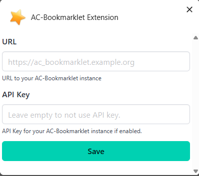

# A Bookmarklet extension

This extension can be used in `Chrome/Chromium browsers` and `Firefox` to add URLs
to [AC-Bookmarklet](https://github.com/arabcoders/ac-bookmarklet) instance.

## Screenshots

## Installation from store

- Install from [Firefox](https://addons.mozilla.org/en-US/firefox/addon/ac-bookmarklet-extension/)
- Install from [Chrome/Chromium Browsers](https://chromewebstore.google.com/detail/ac-bookmarklet-extension/mggohefeggpibffehlcdagelkippfjhk)

## Usage

Configure the extension to point to your **AC-Bookmarklet** instance in the extension options page.

## For issues

To report issues, please use the [GitHub issues page](https://github.com/arabcoders/ac-bookmarklet/issues) at this
repository.